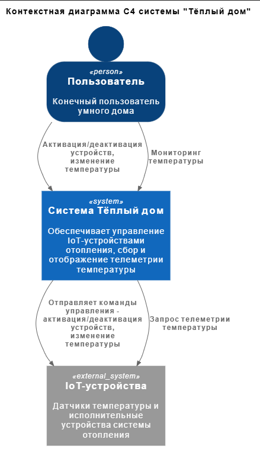
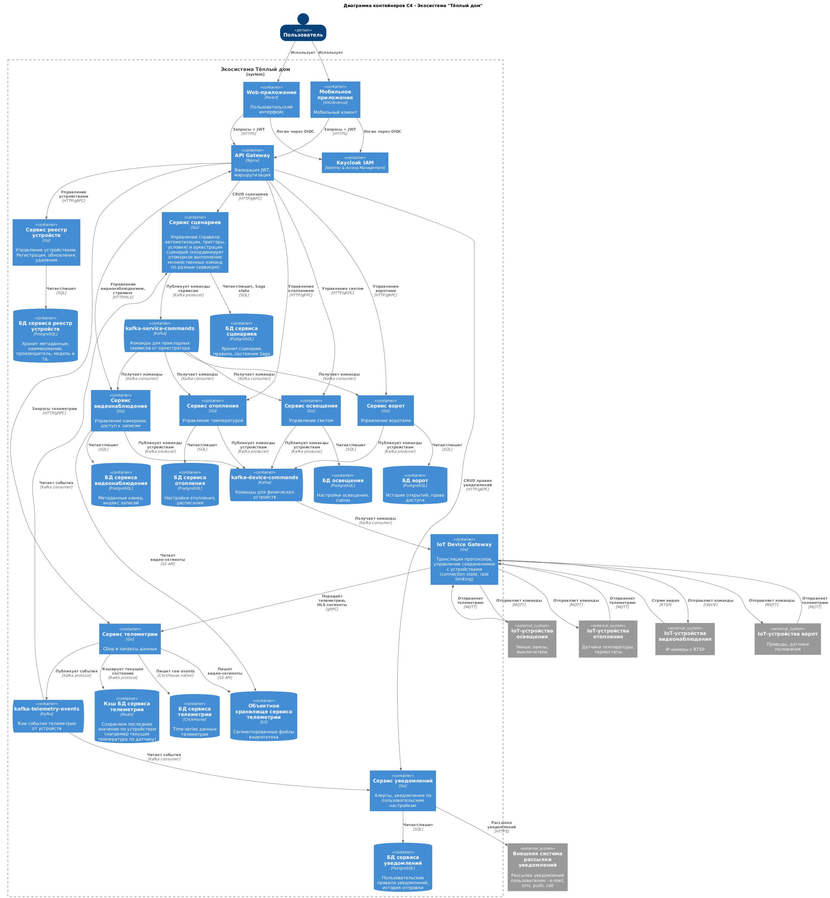
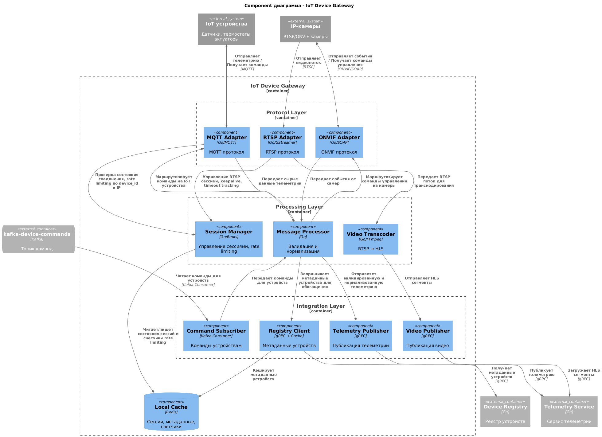
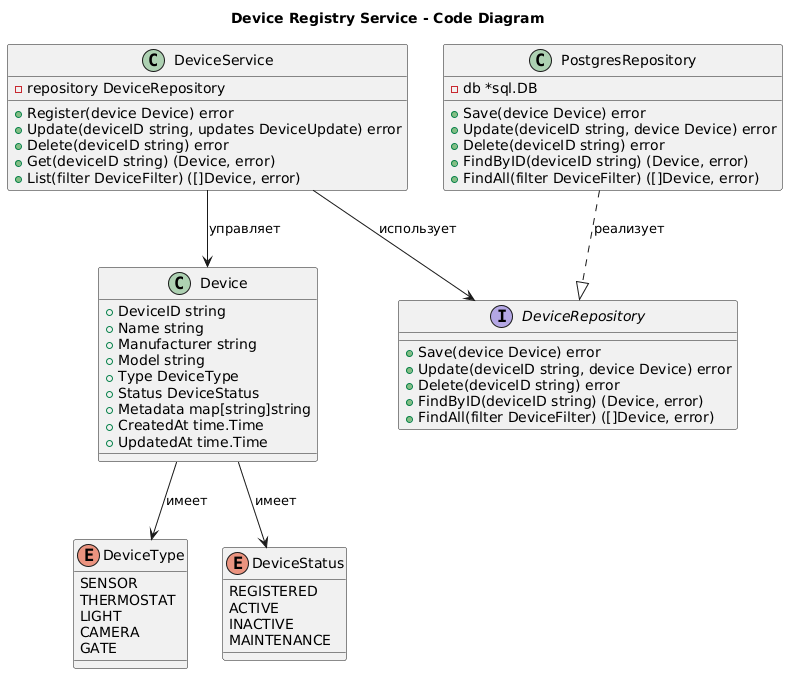
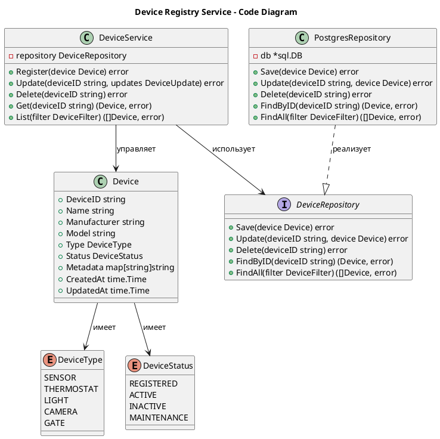
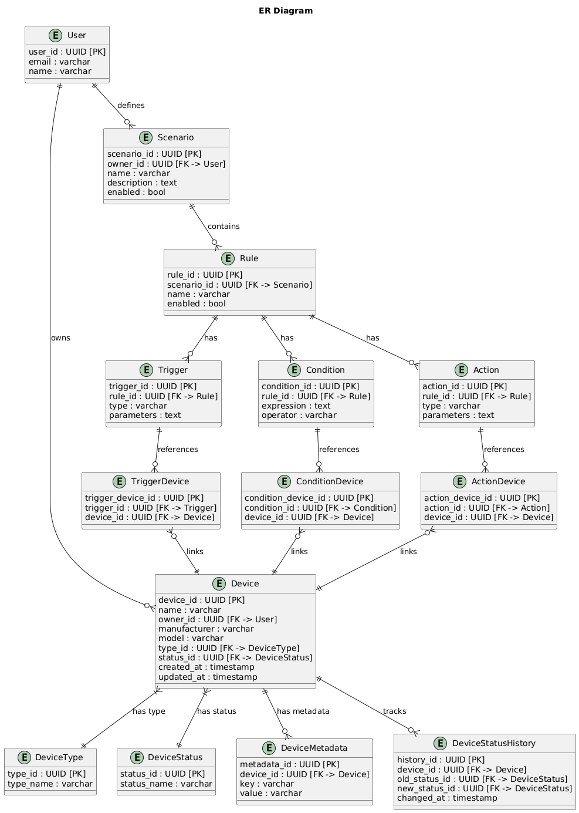
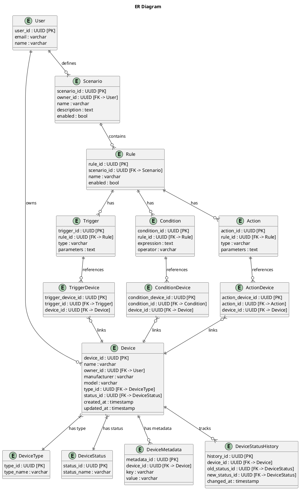

# Архитектура - Тёплый дом

# Задание 1. Анализ и планирование

### 1. Описание функциональности монолитного приложения

- **Управление устройствами:** добавление, удаление, редактирование IoT-устройств и метаданных.
- **Мониторинг:** сбор и отображение данных с датчиков.
- **Управление операциями IoT:** включение/выключение, регулирование.

### 2. Анализ архитектуры монолитного приложения

- Язык программирования: Go
- База данных: PostgreSQL
- Архитектура: Монолитная 
- Все компоненты системы (обработка запросов, бизнес-логика, работа с данными) находятся в рамках одного приложения.
- Взаимодействие: Синхронное, запросы обрабатываются последовательно.
- Масштабируемость: Ограничена, так как монолит сложно масштабировать по частям.
- Развертывание: Требует остановки всего приложения.

### 3. Определение доменов и границы контекстов
- Domain: Конфигуратор IoT-устройств
	- Subdomain: Управление реестром IoT-устройств
		- Context: Контекст управления реестром IoT-устройств
			- Entities: Sensor
			- Value Objects: -
			- Aggregates: -
			- Repositories: DB
			- Services: SensorHandler
- Domain: Мониторинг IoT-устройств
	- Subdomain: Сбор телеметрии датчиков
		- Context: Контекст сбора телеметрии
			- Entities: Sensor
			- Value Objects: -
			- Aggregates: -
			- Repositories: DB
			- Services: SensorHandler, TemperatureService
	- Subdomain: Предоставление телеметрических данных
		- Сontext: Контекст предоставления телеметрии
			- Entities: Sensor
			- Value Objects: -
			- Aggregates: -
			- Repositories: DB
			- Services: SensorHandler
- Domain: Операционное управление IoT-устройствами
	- Subdomain: Управление исполнительными устройствами
		- Context: Контекст управления исполнительными устройствами
			- Entities: Sensor
			- Value Objects: -
			- Aggregates: -
			- Repositories: DB
			- Services: SensorHandler
	- Subdomain: Управление измерительными устройствами
		- Сontext: Контекст управления измерительными устройствами
			- Entities: Sensor
			- Value Objects: -
			- Aggregates: -
			- Repositories: DB
			- Services: SensorHandler							

### **4. Проблемы монолитного решения**
- Отсутствие возможности точечного масштабирования. В монолитной архитектуре все компоненты работают в единой системе, что делает невозможным масштабирование отдельных частей.
- Размытие доменов по DDD, отсутствие четкого разделения. Использование одних и тех же элементов на уровне контекста нарушает принцип ограниченных контекстов (Bounded Context), создает жесткую связанность - сложность параллельной разработки и изолированного тестирования, частые конфликты требующие каскадых изменений по всему монолиту.
- Полностью синхронная архитектура - блокировка потоков выполнения, отсутствие отказоустойчивости.
- Монолитная база данных. Все домены используют одну БД, что создаёт конкуренцию за ресурсы и усложняет миграцию схемы.
- Сложность развёртывания. Любое изменение требует перезапуска всей системы.
- Технологическая зависимость. Невозможно использовать разные технологии для разных доменов.


### 5. Визуализация контекста системы — диаграмма С4

Добавьте сюда диаграмму контекста в модели C4.

Чтобы добавить ссылку в файл Readme.md, нужно использовать синтаксис Markdown. Это делают так:

```plantuml
@startuml 
!include https://raw.githubusercontent.com/plantuml-stdlib/C4-PlantUML/master/C4_Context.puml

SHOW_PERSON_OUTLINE()

title Контекстная диаграмма C4 системы "Тёплый дом"

Person(homeowner, "Пользователь", "Конечный пользователь умного дома")

System(warm_home_system, "Система Тёплый дом", "Обеспечивает управление IoT-устройствами отопления, сбор и отображение телеметрии температуры")

System_Ext(iot_devices, "IoT-устройства", "Датчики температуры и исполнительные устройства системы отопления")

Rel(homeowner, warm_home_system, "Активация/деактивация устройств, изменение температуры")

Rel(homeowner, warm_home_system, "Мониторинг температуры")

Rel(warm_home_system, iot_devices, "Отправляет команды управления - активация/деактивация устройств, изменение температуры")

Rel(warm_home_system, iot_devices, "Запрос телеметрии температуры")
@enduml
```


# Задание 2. Проектирование микросервисной архитектуры

TO BE DDD:

- Domain: Управление жизненным циклом устройств
    - Subdomain: Управление реестром устройств → Device Registry Service
- Domain: Автоматизация умного дома
    - Subdomain: Управление сценариями использования → Scenario Service
- Domain: Управление IoT-устройствами
    - Subdomain: Управление отоплением → Heating Service
    - Subdomain: Управление освещением → Lighting Service
    - Subdomain: Управление воротами → Gate Service
    - Subdomain: Управление видеонаблюдением (команды, запись, хранение HLS-сегментов) → Video Surveillance Service
- Domain: Мониторинг и наблюдение
    - Subdomain: Сбор телеметрии датчиков → Telemetry Service
    - Subdomain: Управление уведомлениями (нотификации, алерты) → Notification Service
- Domain: Идентификация и управление доступом
    - Subdomain: Аутентификация и авторизация (OIDC) → Keycloak
- Domain: Инфраструктура связности (Supporting)
    - Subdomain: Шлюз устройств (трансляция протоколов, транскодинг видеопотока) → IoT Device Gateway
    - Subdomain: API-шлюз (валидация JWT, маршрутизация запросов) → API Gateway


**Диаграмма контейнеров (Containers)**

```plantuml
@startuml C4_Container_Warm_House
!include https://raw.githubusercontent.com/plantuml-stdlib/C4-PlantUML/master/C4_Container.puml

SHOW_PERSON_OUTLINE()

title Диаграмма контейнеров C4 - Экосистема "Тёплый дом"

Person(homeowner, "Пользователь")

System_Boundary(warm_house_system, "Экосистема Тёплый дом") {
    Container(web_app, "Web-приложение", "React", "Пользовательский интерфейс")
    Container(mobile_app, "Мобильное приложение", "iOS/Android", "Мобильный клиент")
    
    Container(api_gateway, "API Gateway", "Nginx", "Валидация JWT, маршрутизация")

    Container(keycloak, "Keycloak IAM", "Identity & Access Management")
    
    Container(device_registry_service, "Сервис реестр устройств", "Go", "Управление устройствами. Регистрация, обновления, удаления")
    ContainerDb(device_registry_service_db, "БД сервиса реестр устройств", "PostgreSQL", "Хранит метаданные, наименование, производитель, модель и тд.")
    
    Container(scenario_service, "Сервис сценариев", "Go", "Управление (правила автоматизации, триггеры, условия) и оркестрация сценарий (координирует атомарное выполнение множественных команд по разным сервисам)")
    ContainerDb(scenario_service_db, "БД сервиса сценариев", "PostgreSQL", "Хранит сценарии, правила, состояния Saga")
    
    Container(heating_service, "Сервис отопления", "Go", "Управление температурой")
    ContainerDb(heating_service_db, "БД сервиса отопления", "PostgreSQL", "Настройки отопления, расписания")
    
    Container(lighting_service, "Сервис освещения", "Go", "Управление светом")
    ContainerDb(lighting_service_db, "БД освещения", "PostgreSQL", "Настройки освещения, сцены")
    
    Container(gate_service, "Сервис ворот", "Go", "Управление воротами")
    ContainerDb(gate_service_db, "БД ворот", "PostgreSQL", "История открытий, права доступа")
    
    Container(video_surveillance_service, "Сервис видеонаблюдения", "Go", "Управление камерами, доступ к записям")
    ContainerDb(video_surveillance_service_db, "БД сервиса видеонаблюдения", "PostgreSQL", "Метаданные камер, индекс записей")
    
    Container(telemetry_service, "Сервис телеметрии", "Go", "Сбор и запросы данных")
    ContainerDb(telemetry_service_db, "БД сервиса телеметрии", "ClickHouse", "Time-series данные телеметрии")
    ContainerDb(telemetry_service_storage, "Объектное хранилище сервиса телеметрии", "S3", "Сегментированные файлы видеопотока")
    ContainerDb(telemetry_service_current_state_db, "Кэш БД сервиса телеметрии", "Redis", "Сохраняем последнее значение по устройствам (например текущая температура по датчику)")
    ContainerQueue(kafka_telemetry_events, "kafka-telemetry-events", "Kafka", "Raw события телеметрии от устройств")
    
    Container(notification_service, "Сервис уведомлений", "Go", "Алерты, уведомления по пользовательским настройкам")
    ContainerDb(notification_service_db, "БД сервиса уведомлений", "PostgreSQL", "Пользовательские правила уведомлений, история отправки")

    ContainerQueue(kafka_service_commands, "kafka-service-commands", "Kafka", "Команды для прикладных сервисов от оркестратора")
    
    ContainerQueue(kafka_device_commands, "kafka-device-commands", "Kafka", "Команды для физических устройств")
    
    Container(iot_device_gateway, "IoT Device Gateway", "Go", "Трансляция протоколов, управление соединениями с устройствами (connection state, rate limiting)")
}

System_Ext(iot_heating_devices, "IoT-устройства отопления", "Датчики температуры, термостаты")
System_Ext(iot_lighting_devices, "IoT-устройства освещения", "Умные лампы, выключатели")
System_Ext(iot_gate_devices, "IoT-устройства ворот", "Приводы, датчики положения")
System_Ext(iot_camera_devices, "IoT-устройства видеонаблюдения", "IP-камеры с RTSP")

System_Ext(notification_provider, "Внешняя система рассылки уведомлений", "Рассылка уведомлений пользователям - e-mail, sms, push, call")
Rel(notification_service, notification_provider, "Рассылка уведомлений", "HTTPS")

Rel(homeowner, web_app, "Использует")
Rel(homeowner, mobile_app, "Использует")

Rel(web_app, keycloak, "Логин через OIDC")
Rel(mobile_app, keycloak, "Логин через OIDC")

Rel(web_app, api_gateway, "Запросы + JWT", "HTTPS")
Rel(mobile_app, api_gateway, "Запросы + JWT", "HTTPS")

Rel(api_gateway, device_registry_service, "Управление устройствами", "HTTP/gRPC")
Rel(api_gateway, scenario_service, "CRUD сценариев", "HTTP/gRPC")
Rel(api_gateway, heating_service, "Управление отоплением", "HTTP/gRPC")
Rel(api_gateway, lighting_service, "Управление светом", "HTTP/gRPC")
Rel(api_gateway, gate_service, "Управление воротами", "HTTP/gRPC")
BiRel(api_gateway, video_surveillance_service, "Управление видеонаблюдением, стриминг", "HTTP/HLS")
Rel(api_gateway, telemetry_service, "Запросы телеметрии", "HTTP/gRPC")
Rel(api_gateway, notification_service, "CRUD правил уведомлений", "HTTP/gRPC")

Rel(device_registry_service, device_registry_service_db, "Читает/пишет", "SQL")
Rel(scenario_service, scenario_service_db, "Читает/пишет, Saga state", "SQL")
Rel(heating_service, heating_service_db, "Читает/пишет", "SQL")
Rel(lighting_service, lighting_service_db, "Читает/пишет", "SQL")
Rel(gate_service, gate_service_db, "Читает/пишет", "SQL")
Rel(video_surveillance_service, video_surveillance_service_db, "Читает/пишет", "SQL")
Rel(video_surveillance_service, telemetry_service_storage, "Читает видео-сегменты", "S3 API")
Rel(notification_service, notification_service_db, "Читает/пишет", "SQL")

Rel(telemetry_service, telemetry_service_db, "Пишет raw events", "ClickHouse native")
Rel(telemetry_service, telemetry_service_storage, "Пишет видео-сегменты", "S3 API")
Rel(telemetry_service, telemetry_service_current_state_db, "Кэширует текущее состояние", "Redis protocol")

Rel(iot_heating_devices, iot_device_gateway, "Отправляет телеметрию", "MQTT")
Rel(iot_lighting_devices, iot_device_gateway, "Отправляет телеметрию", "MQTT")
Rel(iot_gate_devices, iot_device_gateway, "Отправляет телеметрию", "MQTT")
Rel(iot_camera_devices, iot_device_gateway, "Стрим видео", "RTSP")
Rel(iot_device_gateway, telemetry_service, "Передаёт телеметрию, HLS-сегменты", "gRPC")

Rel(telemetry_service, kafka_telemetry_events, "Публикует события", "Kafka protocol")

Rel(kafka_telemetry_events, scenario_service, "Читает события", "Kafka consumer")

Rel(kafka_telemetry_events, notification_service, "Читает события", "Kafka consumer")

Rel(scenario_service, kafka_service_commands, "Публикует команды сервисам", "Kafka producer")

Rel(kafka_service_commands, heating_service, "Получает команды", "Kafka consumer")
Rel(kafka_service_commands, lighting_service, "Получает команды", "Kafka consumer")
Rel(kafka_service_commands, gate_service, "Получает команды", "Kafka consumer")
Rel(kafka_service_commands, video_surveillance_service, "Получает команды", "Kafka consumer")

Rel(heating_service, kafka_device_commands, "Публикует команды устройствам", "Kafka producer")
Rel(lighting_service, kafka_device_commands, "Публикует команды устройствам", "Kafka producer")
Rel(gate_service, kafka_device_commands, "Публикует команды устройствам", "Kafka producer")
Rel(video_surveillance_service, kafka_device_commands, "Публикует команды устройствам", "Kafka producer")

Rel(kafka_device_commands, iot_device_gateway, "Получает команды", "Kafka consumer")

Rel(iot_device_gateway, iot_heating_devices, "Отправляет команды", "MQTT")
Rel(iot_device_gateway, iot_lighting_devices, "Отправляет команды", "MQTT")
Rel(iot_device_gateway, iot_gate_devices, "Отправляет команды", "MQTT")
Rel(iot_device_gateway, iot_camera_devices, "Отправляет команды", "ONVIF")

@enduml
```

**Диаграмма компонентов (Components)**

```plantuml
@startuml C4_Component_IoT_Device_Gateway
!include https://raw.githubusercontent.com/plantuml-stdlib/C4-PlantUML/master/C4_Component.puml

LAYOUT_TOP_DOWN()

title Component диаграмма - IoT Device Gateway

Container_Boundary(iot_gw, "IoT Device Gateway") {
    
    Container_Boundary(protocol_layer, "Protocol Layer") {
        Component(mqtt_adapter, "MQTT Adapter", "Go/MQTT", "MQTT протокол")
        Component(rtsp_adapter, "RTSP Adapter", "Go/GStreamer", "RTSP протокол")
        Component(onvif_adapter, "ONVIF Adapter", "Go/SOAP", "ONVIF протокол")
        
        Lay_R(mqtt_adapter, rtsp_adapter)
        Lay_R(rtsp_adapter, onvif_adapter)
    }
    
    Container_Boundary(processing_layer, "Processing Layer") {
        Component(session_manager, "Session Manager", "Go/Redis", "Управление сессиями, rate limiting")
        Component(message_processor, "Message Processor", "Go", "Валидация и нормализация")
        Component(video_transcoder, "Video Transcoder", "Go/FFmpeg", "RTSP → HLS")
        
        Lay_R(session_manager, message_processor)
        Lay_R(message_processor, video_transcoder)
    }
    
    Container_Boundary(integration_layer, "Integration Layer") {
        Component(registry_client, "Registry Client", "gRPC + Cache", "Метаданные устройств")
        Component(command_subscriber, "Command Subscriber", "Kafka Consumer", "Команды устройствам")
        Component(telemetry_publisher, "Telemetry Publisher", "gRPC", "Публикация телеметрии")
        Component(video_publisher, "Video Publisher", "gRPC", "Публикация видео")
        
        Lay_R(registry_client, command_subscriber)
        Lay_R(command_subscriber, telemetry_publisher)
        Lay_R(telemetry_publisher, video_publisher)
    }
    
    ComponentDb(local_cache, "Local Cache", "Redis", "Сессии, метаданные, счетчики")
    
    Lay_D(protocol_layer, processing_layer)
    Lay_D(processing_layer, integration_layer)
}

System_Ext(iot_devices, "IoT устройства", "Датчики, термостаты, актуаторы")
System_Ext(ip_cameras, "IP-камеры", "RTSP/ONVIF камеры")

Container_Ext(telemetry_service, "Telemetry Service", "Go", "Сервис телеметрии")
Container_Ext(device_registry, "Device Registry", "Go", "Реестр устройств")
ContainerQueue_Ext(kafka_commands, "kafka-device-commands", "Kafka", "Топик команд")

BiRel(iot_devices, mqtt_adapter, "Отправляет телеметрию / Получает команды", "MQTT")
Rel(ip_cameras, rtsp_adapter, "Отправляет видеопоток", "RTSP")
BiRel(ip_cameras, onvif_adapter, "Отправляет события / Получает команды управления", "ONVIF/SOAP")

Rel_D(mqtt_adapter, session_manager, "Проверка состояния соединения, rate limiting по device_id и IP")
Rel_D(rtsp_adapter, session_manager, "Управление RTSP сессией, keepalive, timeout tracking")
Rel_D(mqtt_adapter, message_processor, "Передает сырые данные телеметрии")
Rel_D(onvif_adapter, message_processor, "Передает события от камер")
Rel_D(rtsp_adapter, video_transcoder, "Передает RTSP поток для транскодирования")

Rel_D(message_processor, registry_client, "Запрашивает метаданные устройства для обогащения")
Rel_D(message_processor, telemetry_publisher, "Отправляет валидированную и нормализованную телеметрию")
Rel_D(video_transcoder, video_publisher, "Отправляет HLS сегменты")

Rel_D(command_subscriber, message_processor, "Передает команды для устройств")
Rel_U(message_processor, mqtt_adapter, "Маршрутизирует команды на IoT устройства")
Rel_U(message_processor, onvif_adapter, "Маршрутизирует команды управления на камеры")

Rel(session_manager, local_cache, "Читает/пишет состояния сессий и счетчики rate limiting")
Rel(registry_client, local_cache, "Кэширует метаданные устройств")

Rel(telemetry_publisher, telemetry_service, "Публикует телеметрию", "gRPC")
Rel(video_publisher, telemetry_service, "Загружает HLS сегменты", "gRPC")
Rel(registry_client, device_registry, "Получает метаданные устройств", "gRPC")
Rel(kafka_commands, command_subscriber, "Читает команды для устройств", "Kafka Consumer")
@enduml
```

**Диаграмма кода (Code)**




# Задание 3. Разработка ER-диаграммы


# Задание 4. Создание и документирование API

### 1. Тип API

Для взаимодействия микросервисов в системе "Тёплый дом" используется **REST API** для синхронного взаимодействия.

**Обоснование выбора REST API:**

1. **Немедленный ответ требуется**: Сервис реестра устройств используется другими микросервисами (IoT Device Gateway, Scenario Service, Heating Service и др.) для получения метаданных устройств. Эти сервисы нуждаются в немедленном ответе для обогащения данных телеметрии, валидации команд и принятия решений.

2. **Простота интеграции**: REST API на основе HTTP проще интегрировать и отлаживать по сравнению с асинхронными протоколами. Это упрощает разработку и поддержку.

3. **Кэширование**: HTTP-протокол позволяет эффективно использовать кэширование на уровне API Gateway и клиентов, что критично для часто запрашиваемых метаданных устройств.

4. **Стандартизация**: REST API хорошо стандартизирован, имеет богатую экосистему инструментов (Swagger/OpenAPI, Postman) и понятен большинству разработчиков.

**AsyncAPI используется для:**
- Асинхронной обработки событий телеметрии через Kafka (kafka-telemetry-events)
- Распределения команд устройствам через Kafka (kafka-device-commands, kafka-service-commands)
- Уведомлений о событиях, которые не требуют немедленного ответа

### 2. Документация API

Сервис реестр устройств (Device Registry Service) O

**Файл документации:** [`schemas/device-registry-api.yaml`](schemas/device-registry-api.yaml)


# Задание 5. Работа с docker и docker-compose

Перейдите в apps.

Там находится приложение-монолит для работы с датчиками температуры. В README.md описано как запустить решение.

Вам нужно:

1) сделать простое приложение temperature-api на любом удобном для вас языке программирования, которое при запросе /temperature?location= будет отдавать рандомное значение температуры.

Locations - название комнаты, sensorId - идентификатор названия комнаты

```
	// If no location is provided, use a default based on sensor ID
	if location == "" {
		switch sensorID {
		case "1":
			location = "Living Room"
		case "2":
			location = "Bedroom"
		case "3":
			location = "Kitchen"
		default:
			location = "Unknown"
		}
	}

	// If no sensor ID is provided, generate one based on location
	if sensorID == "" {
		switch location {
		case "Living Room":
			sensorID = "1"
		case "Bedroom":
			sensorID = "2"
		case "Kitchen":
			sensorID = "3"
		default:
			sensorID = "0"
		}
	}
```

2) Приложение следует упаковать в Docker и добавить в docker-compose. Порт по умолчанию должен быть 8081

3) Кроме того для smart_home приложения требуется база данных - добавьте в docker-compose файл настройки для запуска postgres с указанием скрипта инициализации ./smart_home/init.sql

Для проверки можно использовать Postman коллекцию smarthome-api.postman_collection.json и вызвать:

- Create Sensor
- Get All Sensors

Должно при каждом вызове отображаться разное значение температуры

Ревьюер будет проверять точно так же.


# **Задание 6. Разработка MVP**

Необходимо создать новые микросервисы и обеспечить их интеграции с существующим монолитом для плавного перехода к микросервисной архитектуре. 

### **Что нужно сделать**

1. Создайте новые микросервисы для управления телеметрией и устройствами (с простейшей логикой), которые будут интегрированы с существующим монолитным приложением. Каждый микросервис на своем ООП языке.
2. Обеспечьте взаимодействие между микросервисами и монолитом (при желании с помощью брокера сообщений), чтобы постепенно перенести функциональность из монолита в микросервисы. 

В результате у вас должны быть созданы Dockerfiles и docker-compose для запуска микросервисов. 